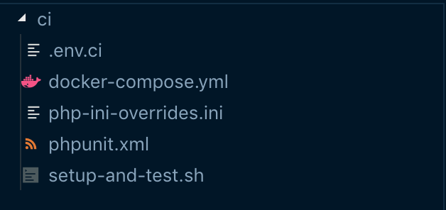

If your application has dependencies that are not covered by Bitbucket Pipelines [built-in services](https://confluence.atlassian.com/bitbucket/use-services-and-databases-in-bitbucket-pipelines-874786688.html), or these dependencies are more complex that simply checking that a container is running, [docker-compose](https://docs.docker.com/compose/) can be a helpful tool.  


In my case, I want to setup CI on a Symfony + MySQL + Elasticsearch (which is not available as a pipeline service) application. I just want to run phpunit tests, so I don't need an HTTP server. The dependencies are as follows:

* MySQL has no dependencies,
* Elasticsearch has no dependencies,
* PHP depends on MySQL and Elasticsearch for bootstraping and running tests.

These look pretty straightforward and can be expressed in docker-compose. However as always, the devil is in the details: not only should the Elasticsearch container be up, the service should be **ready** for the tests to run correctly.


Pipelines use docker containers to run our application and let us use whatever image we need. We will use this to our advantage and use [an image](https://github.com/tiangolo/docker-with-compose) with docker-compose available.


## Folder structure

We will create a `ci/` folder which will contain the files we will use in our CI environment.  


* *.env.ci* contains environment variables if you use DotEnv
* *phpunit.xml* contains configuration for phpunit
* *php-ini-overrides.ini* is self-explanatory
* *docker-compose.yml* describes the containers we need
* *setup-and-test.sh* will bootstrap our application and run tests against it.

### docker-compose.yml

```yaml
version: "3.1"
services:

    mysql:
      image: mysql:5.7
      container_name: my-db-server
      working_dir: /application
      volumes:
        - ../:/application
      environment:
        - MYSQL_ROOT_PASSWORD=root
        - MYSQL_DATABASE=my-db
      ports:
        - "8002:3306"

    elasticsearch:
      image: docker.elastic.co/elasticsearch/elasticsearch:6.8.1
      container_name: elasticsearch
      working_dir: /application
      environment:
          - xpack.security.enabled=false
          - "transport.host=localhost"
          - "bootstrap.system_call_filter=false"
      volumes:
          - ../:/application
      ports:
          - "9200:9200"
      tty: true

    php-fpm:
      image: chodoul1egal2/php72-mysql
      working_dir: /application
      volumes:
        - ../:/application
        - ./php-ini-overrides.ini:/etc/php/7.2/fpm/conf.d/99-overrides.ini
      depends_on:
        - elasticsearch
        - mysql

```


A few things to note:

* The [docker image I use for php-fpm](https://hub.docker.com/r/chodoul1egal2/php72-mysql) is a custom one which includes the modules I need for my application (notably php-mysql). [You might need a different one](https://phpdocker.io/).
* No volumes are needed as nothing needs to be persisted in a CI context

### setup-and-test.sh

```bash
#!/bin/bash

# Make sure CI stops as soon as something wrong happens
set -eu

# Inspiration for this script:
# https://github.com/elastic/elasticsearch-py/issues/778#issuecomment-384389668

host="http://elasticsearch:9200"


until $(curl --output /dev/null --silent --head --fail "$host"); do
    printf '.'
    sleep 1
done

# Wait for ES to be available
response=$(curl $host)

until [ "$response" = "200" ]; do
    response=$(curl --write-out %{http_code} --silent --output /dev/null "$host")
    echo "Elasticsearch is unavailable - sleeping"
    sleep 1
done


# Wait for ES to be ready
health="$(curl -fsSL "$host/_cat/health?h=status")"
health="$(echo "$health" | sed -r 's/^[[:space:]]+|[[:space:]]+$//g')"

until [ "$health" = 'green' ]; do
    health="$(curl -fsSL "$host/_cat/health?h=status")"
    health="$(echo "$health" | sed -r 's/^[[:space:]]+|[[:space:]]+$//g')"
    echo "Elasticsearch is unavailable - sleeping"
    sleep 1
done

echo "ES is up"

# Install dependencies
composer install --no-interaction

echo "bootstrapping"
#
# YOUR BOOTSTRAPPING LOGIC HERE
#

# php bin/console ...
# php bin/console fos:elastica:populate
echo "done"
echo "tests"
vendor/bin/simple-phpunit --stop-on-failure 
echo "over"

```


## Pipelines configuration

Finally, the bitbucket-pipelines.yml file:  

```yaml
image: tiangolo/docker-with-compose

definitions:
  services: 
    docker:
      memory: 2048

pipelines:
  default:
    - step:
        size: 2x
        caches:
          - composer
          - docker
        script:
          - cp ci/.env.ci ./.env
          - cp ci/phpunit.ci ./phpunit.xml
          - docker-compose -f ci/docker-compose.yml up -d && sleep 5
          - docker-compose -f ci/docker-compose.yml exec -T php-fpm ci/setup-and-test.sh 
        services: 
          - docker 
```

* the `sleep 5` is an ugly hack to avoid timing problems related to the `- d` flag on `docker-compose`. Removing `-d` implies having a lot of noise in your pipeline logs. If you have a better solution, please share!
* Elasticsearch will use a lot memory, so we use `size: 2x` and give the `docker` service enough memory.