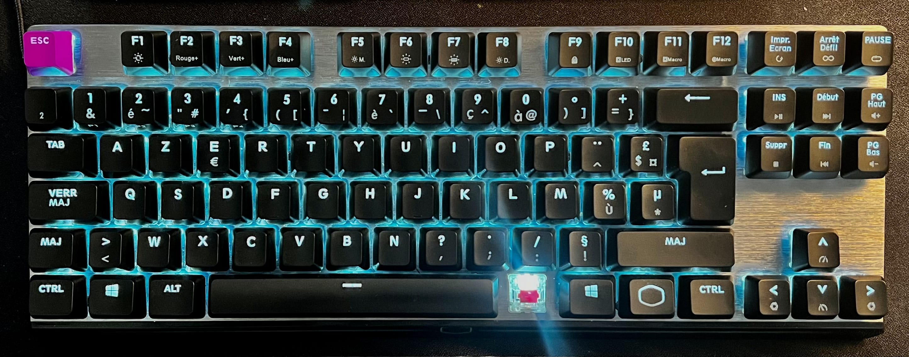
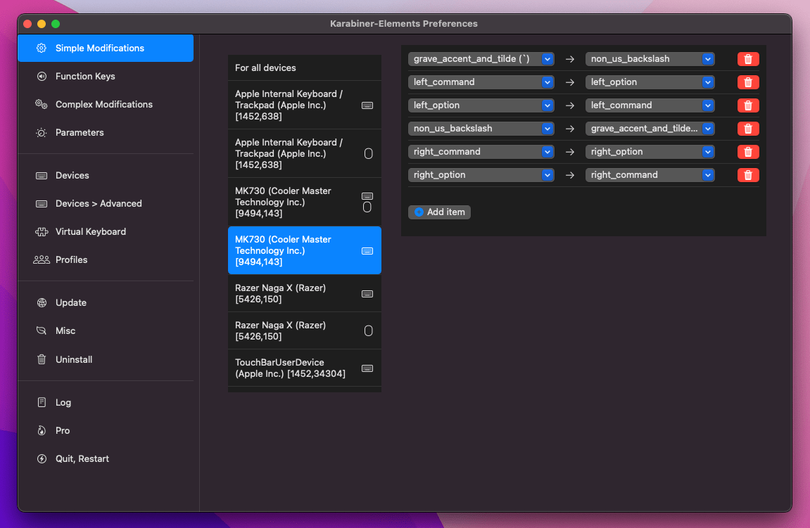
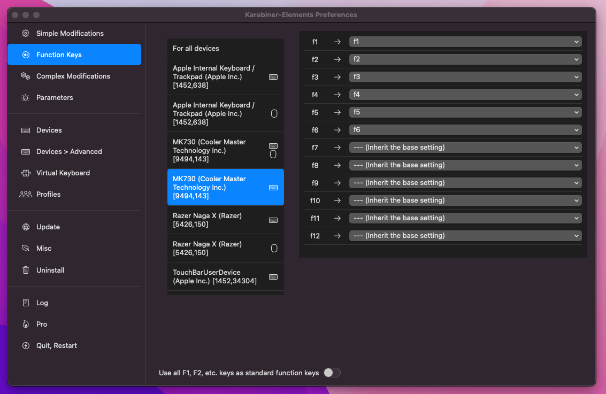

I recently purchased this keyboard to replace my TKL because I sometimes need F* keys.  
The keyboard itself is pretty well build, but I had to go through some loops to get it to work as expected on macOS.

First, the provided USB cable is a USB type A, which my macbook doesn't have. When I tried to replace it with a (powered) type C cable, the keyboard wasn't recognized, so I opted for an adapter from SATECHI instead.

Second, my muscle memory conflicted with the layout when doing some key combinations, so I removed the keycap of the key immediately to the right of the space bar in order to stop hitting it by mistake.  



Third, some keys had to be remapped. I used [Karabiner-Elements](https://karabiner-elements.pqrs.org) with the following configuration:




In JSON:

```json
{
    "disable_built_in_keyboard_if_exists": false,
    "fn_function_keys": [
        {
            "from": {
                "key_code": "f1"
            },
            "to": [
                {
                    "key_code": "f1"
                }
            ]
        },
        {
            "from": {
                "key_code": "f2"
            },
            "to": [
                {
                    "key_code": "f2"
                }
            ]
        },
        {
            "from": {
                "key_code": "f3"
            },
            "to": [
                {
                    "key_code": "f3"
                }
            ]
        },
        {
            "from": {
                "key_code": "f4"
            },
            "to": [
                {
                    "key_code": "f4"
                }
            ]
        },
        {
            "from": {
                "key_code": "f5"
            },
            "to": [
                {
                    "key_code": "f5"
                }
            ]
        },
        {
            "from": {
                "key_code": "f6"
            },
            "to": [
                {
                    "key_code": "f6"
                }
            ]
        }
    ],
    "identifiers": {
        "is_keyboard": true,
        "is_pointing_device": false,
        "product_id": 143,
        "vendor_id": 9494
    },
    "ignore": false,
    "manipulate_caps_lock_led": true,
    "simple_modifications": [
        {
            "from": {
                "key_code": "grave_accent_and_tilde"
            },
            "to": [
                {
                    "key_code": "non_us_backslash"
                }
            ]
        },
        {
            "from": {
                "key_code": "left_command"
            },
            "to": [
                {
                    "key_code": "left_option"
                }
            ]
        },
        {
            "from": {
                "key_code": "left_option"
            },
            "to": [
                {
                    "key_code": "left_command"
                }
            ]
        },
        {
            "from": {
                "key_code": "non_us_backslash"
            },
            "to": [
                {
                    "key_code": "grave_accent_and_tilde"
                }
            ]
        },
        {
            "from": {
                "key_code": "right_command"
            },
            "to": [
                {
                    "key_code": "right_option"
                }
            ]
        },
        {
            "from": {
                "key_code": "right_option"
            },
            "to": [
                {
                    "key_code": "right_command"
                }
            ]
        }
    ],
    "treat_as_built_in_keyboard": false
},
```
