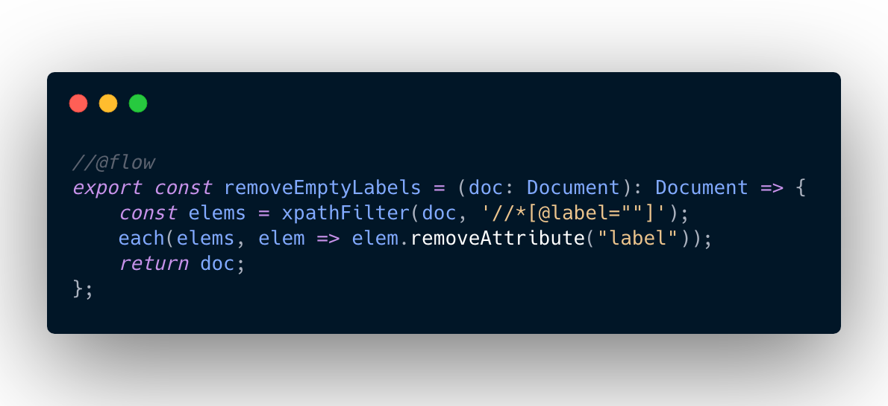

[cuisine-ead](https://cuisine-ead.netlify.com) is a tool for batch editing xml-ead files in-browser.

<small>(At the moment, it is available in french only.)</small>

## The problem

__[EAD](https://www.wikiwand.com/en/Encoded_Archival_Description) is a schema traditionally used by archives and libraries to encode metadata regarding
archival records.__

Although the schema itself is standard, its use and interpretation differ wildly across tools and organizations.  
This leads to difficulties during migrations from one tool to the next, for non-technical users especially or departments lacking the ability
to hire external experts.  

I've found that some xml-ead users typically have __deep knowledge of the intellectual concepts of EAD and its tag library, but lack the technical ability to effectively and reliably edit XML documents__, often relying on text editors and string replacement.  


Last but not least, using online services for such tasks raises privacy concerns, as the data or metadata can be confidential.

## What this tool does

Browsers are very good at two things (among others):  

* parsing XML strings into DOM documents and
* processing DOM documents.


My goals with this tool are:

* to leverage decades of optimisations in this space to process hundreds megabytes of xml-ead files in milliseconds,
* to provide a reusable set of tools for users to combine as they see fit,
* to do so without uploading any data online.  

### Workflow

1. Users drop their files on the page,
2. pick the modifications they want to apply, with or without configuration,
3. preview, iterate, apply the changes, then
4. download back the files.

### Implementation, in short

Each available "modification" is a small function called "Recipe" (not to betray the cooking theme), with the following signature:

```javascript
//@flow
type Recipe = (doc: Document) => Document;
```

For example:


Recipes can be made configurable using curried functions:

```javascript
//@flow
type ConfigurableRecipe = (config: any) => Recipe;
```

All chosen recipes will be composed in a final function called "Pipeline", which will map unprocessed xml strings to processed xml strings.

```javascript
//@flow

// Short implementation
const getPipeline = (chosenRecipes: Array<Recipe>) => (xmlString: string) => {
    const doc = strToDOMDocument(xmlString);
    const processedDoc = pipe(...chosenRecipes)(doc);
    return DOMDocumentToStr(processedDoc);
};
const output = getPipeline(chosenRecipes)(input);
```

## Notable challenges

* Since the DOM API mutates the document, making `pipeline()` pure requires creating a new `Document` for every application of `pipeline()`
* As can be expected of JavaScript code, it is mostly written to run on a single thread, insofar as the `pipeline()` function is concerned. This makes the processing of large files slow, and can prevent low-hanging fruit optimisations with workers.
* Many users multiplied by many existing tools^2 makes for quite the explosive number of recipes necessary to please everyone, making this tool not scalable beyond a certain number of use cases. This can be mitigated with UI.
* Using megabytes-long strings as memoization keys turns out to be suboptimal. However, this can be solved by [throwing WebAssembly at the problem](https://github.com/jungomi/xxhash-wasm).
