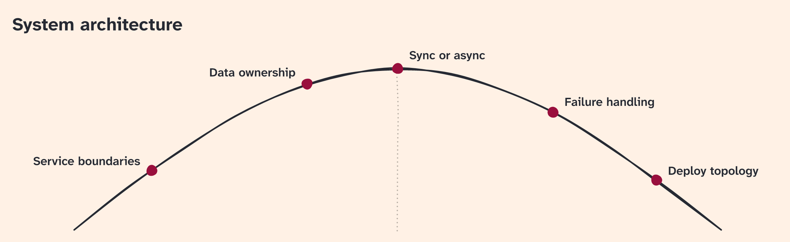

I've always loved the hill chart from Basecamp (and [Shape Up](https://basecamp.com/shapeup/3.4-chapter-13)).  
What's uphill isn't properly defined or scoped yet; what's downhill is bounded and just needs to be implemented.  
I think it's a fine way to show progress: it doesn't lie to you with fake percentages of completion, yet communicates clearly what you're still figuring out, and what is close to the finish line.  

It's also a good fit for agents in long-running, goal-pursuing sessions, or for orchestrators. The human can see at a glance where things stand.  

Anyway, I made a [Node package](https://www.npmjs.com/package/@camille-hdl/hill-chart) that encapsulates the (relative) complexity of drawing an SVG or a PNG in low fidelity, yet with legible text, so that your agent doesn't need to think too hard: just make a JSON with a title and a position between 0 and 1 for each scope, and pass it to the package. It's themeable too. I paid the extra thinking tokens so you don't have to.  

There are other implementations out there, but they are designed for interactivity. Mine is static, and more lightweight.

There is a skill too. Point your clanker to this page and it'll figure it out for you.

## For agents

Read this section when a person wants a hill chart drawn, or wants the hill-chart skill or the `@camille-hdl/hill-chart` package. The chart above is an example. Scopes and positions come from the person's own project. The rest of this page is the article for human readers.

### Draw or update a chart

Install the hill-chart skill, then follow it. It places each scope and draws the chart.

```bash
npx skills add camille-hdl/skills --skill hill-chart
```

Other install options are in the [skills repository](https://github.com/camille-hdl/skills).

Done when you are following [the skill](https://github.com/camille-hdl/skills/blob/main/skills/hill-chart/SKILL.md).

### Use the package

When the task is the CLI or the API, from a script or a program, read the [`@camille-hdl/hill-chart` README](https://github.com/camille-hdl/hill-chart) and use the part that matches the task: the data format, the CLI, or the API.

Done when that part has been read and you are using it.
