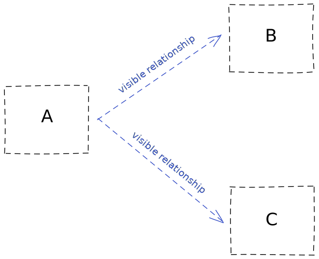
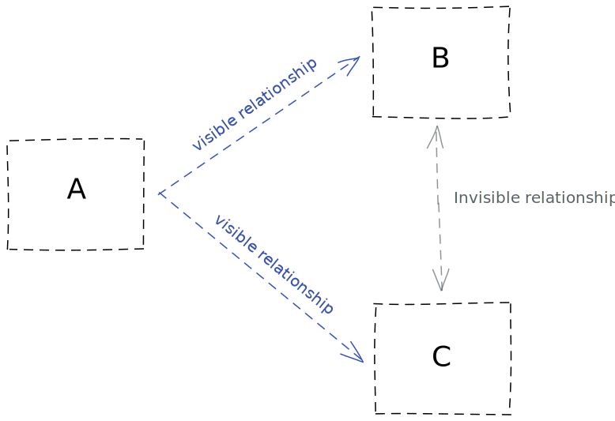

The word "*postmortem*" can mean both the process and its artifact: the document in which you describe the incident,
its resolution and what could be done to prevent it from happening again.

## Why run a postmortem?

Your system is much more than your IT system. It includes parts of the real world: yourself, your fellow engineers, your boss, your users, your vendors, space, and the worst of all: time.  
This complexity makes it difficult to predict, let alone prevent, failures.  

**Incidents will certainly happen: you want to benefit, not be harmed, from them.** 

> "Antifragile systems benefit (to some degree) from [uncertainty, disorder, error, time...]"  
> <u>Antifragile</u>, Nassim Nicholas Taleb (2012)

Incident postmortems are a way to increase organisational knowledge through incident resolution. After each incident, your system should be stronger than before.

In failure, a system reveals new information about itself, particularly hidden relationships between components.  

Imagine a simple system with 3 components A, B and C, with the following properties:  
* A connects to B,
* A connects to C,
* there is no visible relationship between B and C,
* every process spawned by A opens a connection to both B and C.

Your mental model is the following:  

Suddenly, B starts to slow down. This causes A to keep many open connections to C, eventually causing it to drop new incoming connections. When A can't open new connections to C, it starts failing as well.  
You have discovered a hidden relationship between B and C. Your new mental model is:  

Your ideal postmortem would produce a document that describes how to change the system to prevent the problem from happening again.  
Otherwise, if it does happen again, explain how to reduce the impact and get to a resolution faster.

## When to run a postmortem?

When your system suffers an incident that hurts you enough.  
In theory, you should do it for *every* incident. In practise, you probably don't have infinite resources allocated to this, so you could **start by focusing on incidents impacting directly customers** and/or stakeholders.  

You should run it as temporally close as possible to the incident, maybe even start during its resolution, so that everybody's memory is still fresh.

## Do

### Describe what happened
Clearly state the impact of the incident: 
* who?
* what?
* for how long?

Give a **timeline** of events and communication between people involved, relating to the incident.

Try to find the **root cause**, insofar as it is actionable:
* [the five whys](https://en.wikipedia.org/wiki/Five_whys)
* prefer practicality over "truth"
* document how you got to the root cause

> There is an important difference between truth and utility.  
> <u>Data & Reality</u>, William Kent (1978)

Involve the whole team if you can, so that you have as much brainpower as possible, everybody learns, and you will hopefully resolve the incident before it cascades downstream.

> Problems are **swarmed** and solved, resulting in quick construction of new knowledge.  
> <u>The DevOps Handbook</u>, Gene Kim, Jez Humble, Patrick Debois, John Willis (2006)

### Suggest improvements to the system

If it happens again:
- document the mitigation steps so that someone else could do it faster
- what could be done to minimize the impact

Pay attention to **information flow, feedbacks, and delays** to communication:
* did we get notified of the incident early enough?
* did the right people get notified?
* did the right sub-systems (e.g. autoscaling) get the right feedback?

> Changing the length of a delay may make a large change in the behavior of the system.  
> <u>Thinking in Systems</u>, Donella H. Meadows (2008)

## Don't

### Blame people
If you start naming and shaming, [people will have an incentive to hide information](https://codeascraft.com/2012/05/22/blameless-postmortems/), which undermines the whole process.

### Dig too deep
The is no real boundary between your system and the rest of the world. It is a continuum. In your quest for the root cause, you may be tempted to reach far into territory you have no control over, which has rapidly diminishing returns.

## What to do with the document?

Remember that the objective is to help yourself and your organization learn:
* make your postmortem documents **searchable**,
* widely **available**, 
* **understandable** by the audience (engineers, stakeholders, users, ...).

## Inspiration

Here is a list of public (and verbose) incident postmortem documents:

* [Summary of the Amazon Kinesis Event in the Northern Virginia (US-EAST-1) Region](https://aws.amazon.com/message/11201/)
* [Google Cloud Networking Incident #19009](https://status.cloud.google.com/incident/cloud-networking/19009)
* [Stripe - Root cause analysis: significantly elevated error rates on 2019‑07‑10](https://stripe.com/rcas/2019-07-10)