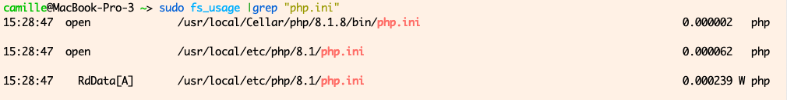

The program `fs_usage` displays pathnames accessed by processes in real time.  
It's an extremely useful debugging tool.  

It has options to select for the specific system calls or processes you're interested in, or you can simply `grep` it.

For instance, if you're unsure which php.ini file is used by your php environment, you can run

```shell
sudo fs_usage |grep "php.ini"
```

then run some php code and see pathnames in real time, as they are accessed:



<aside class="my-comment">
    <p>
    Note that <code>fs_usage</code> needs to be run as <code>sudo</code>.
    </p>
</aside>

The output of this program is easier to read than something like `dtruss`, as long as you are only interested in file-system related system calls.

# Read more

- https://developer.apple.com/library/archive/documentation/Performance/Conceptual/FileSystem/Articles/FileSystemCalls.html