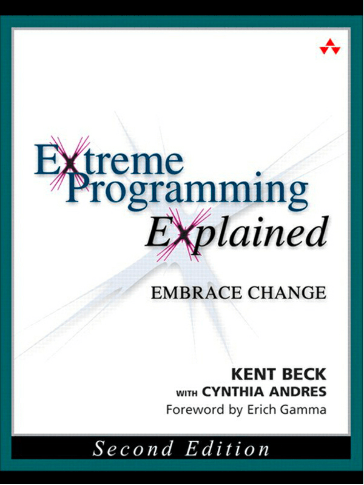

Kent Beck attempts the difficult task of transferring tacit knowledge about software engineering through text.  

Drawing mostly from his own experience and from the Agile movement, Beck outlines a process, "XP", which reflects how he thinks a software development effort ought to be run. The content barely mentions any specific technology and is structured around "Values, Principles and Practices", making it still valuable decades after its publication.  

While I wouldn't apply everything mentioned in the book, I learned a lot from it and would recommend it to other programmers.

The text tries very hard to compress its message into simple, marketable terms such as "economics" or "flow" which, to me, are too generic to be useful, but the author is fortunately too smart to help himself from getting into nuances.  
This is precisely why I think this book compares favorably to other competitors of the same category (veterans who want to tell you how to do your job): the advices it give have nuances, depend on the context to which they are applied, and don't hide the uncertainty or tradeoffs inherent to the subject matter.

I don't recall any instance of "You should do X in any context, because it's the right thing to do" in its pages (with the possible exception of TDD), which I appreciate.

# Highlights

On prioritization and fitness of the solution to the business problem under uncertainty:

> Make sure what you are doing has business value, meets business goals, and serves business needs. For example, solving the highest priority business need first maximizes the value of the project.

> Quality is not a control variable. Projects don’t go faster by accepting lower quality. They don’t go slower by demanding higher quality. Pushing quality higher often results in faster delivery; while lowering quality standards often results in later, less predictable delivery.

> The question is not whether or not to design, the question is when to design. Incremental design suggests that the most effective time to design is in the light of experience.

> Write contracts for software development that fix time, costs, and quality but call for an ongoing negotiation of the precise scope of the system. Reduce risk by signing a sequence of short contracts instead of one long one.

> Plans are not predictions of the future. At best, they express everything you know today about what might happen tomorrow. Their uncertainty doesn’t negate their value.

The author mentions themes that made me think of the idea of "antifragility", the desirable property of something that gets stronger in adversity:

> When replacing a legacy system, gradually take over its workload beginning very early in the project.

> The cost of the redundancy is more than paid for by the savings from not having the disaster.

> Isn’t failure waste? No, not if it imparts knowledge. Knowledge is valuable and sometimes hard to come by. Failure may not be avoidable waste.

On designing:

> Here are four criteria used to evaluate the simplicity of a design:   
> 1. Appropriate for the intended audience.
> 2. Communicative
> 3. Factored
> 4. Minimal

