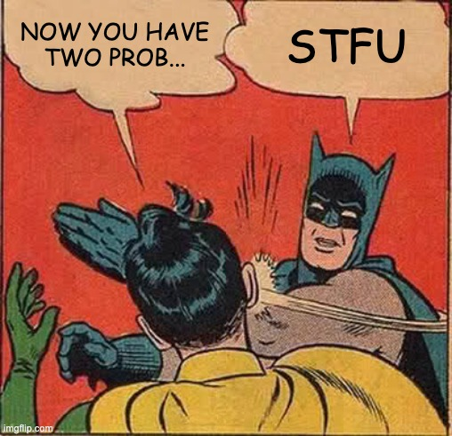

A *regex*, *regexp* or *regular expression* is a notation used to describe a **language** : letters and words governed by a set of rules.  

For instance: the language described by `ab*c` includes strings that start with an `a`, followed by any number of `b`s (including 0), then a `c`.  

The [syntax](https://www.regular-expressions.info/refquick.html) features literal characters, metacharacters (`.`), character classes, quantifiers (`+`), alternation (`|`), flags (`m`), and more.  

In a programming context, they are used to find strings of characters that match the described language, and sometimes act on those matches.

Typical applications include text processing, text generation and input validation.

When writing a regex, it is generally **easy to match what we're looking for but difficult not to match what we want to exclude**.  
In short, edge cases can be a real pain. Consequently, one of the most useful piece of advice one can give you about regex is when not to use them.

Here are some non-exhaustive examples of good and bad applications.

### What are regexes good at?

* looking for simple information in a text (*"Find all the phone numbers in this paragraph"*)
* simple pattern-based string validation (*"Is this a well-formed ISO8601 date?"*)
* tokenization (*"Is this a reserved word?"*)
* advanced search and replace

### What are regexes bad at?

* parsing languages with any kind of limitless nesting (programming languages with `()`, `{}`, XML `<>`, etc.)
* complex string validation (*"Is this a valid email?"*)
* natural language processing (*"Who is the subject in this sentence?"*)

## Theory and tools

Think of a regular expression as a program. This program is a [finite state automaton](https://en.wikipedia.org/wiki/Finite-state_machine)(FSM) written in an extremely concise form.

If you go looking for documentation on regular expressions on the internet, you may stumble upon conflicting information such as *"it has limited memory"* and *"you can reference any number of capturing groups"*.  
This is because, **depending on the context, "regular expressions" means the theory or the practical tools build from the theory, such as software libraries**.  

For example PCRE (Perl-Compatible Regular Expressions) has features like assertions ([lookaround](https://www.regular-expressions.info/lookaround.html)) and recursion that go beyond what is possible with a FSM.

## In practise

Virtually every programming environment has some kind of regex support. Here are some examples.

### Unix

Famous programs such as `grep` and `awk` heavily use regular expressions.

### PHP

All the `preg_`-[prefixed functions](https://www.php.net/manual/en/ref.pcre.php) are based on PCRE.  
Notable particularities include the `preg_match_all` function that effectively replaces the `g` flag.

You can find a few interesting examples in the [league/uri](https://github.com/thephpleague/uri/blob/master/src/Uri.php) codebase.

### JavaScript

JavaScript goes a step further than PHP in its support:

* the `RegExp` object is built into the language,
* there is a literal form: `/ab*c/.test("abbbc")` is valid code.

Learn more on [MDN](https://developer.mozilla.org/en-US/docs/Web/JavaScript/Reference/Global_Objects/RegExp).

### Websites

* [iHateRegex](https://ihateregex.io/) lets you visualize your regex as a graph, which illustrates well its automaton origin.
* [regex101](https://regex101.com/) is an interactive regex editor which does a good job explaining what your expression does, and lets you choose your engine (PCRE, JavaScript, and more).
* [extendsclass](https://extendsclass.com/regex-tester.html) has a regexp tester and visualizer.
* [regular-expressions.info](https://www.regular-expressions.info/) provides useful documentation.

## A bit of History

* [Stephen Kleene](https://en.wikipedia.org/wiki/Stephen_Cole_Kleene) seems to be generally considered the inventor of Regular Expressions, in the early 1950s.
* Also in the 50s, Chomsky introduced his [hierarchy of languages](https://en.wikipedia.org/wiki/Chomsky_hierarchy), with regular languages being "Type-3".
* One of the first usage in a program is attributed to [Ken Thompson's ED text editor](https://en.wikipedia.org/wiki/Ed_(text_editor)) (and, also, one of the first examples of just-in-time compilation), in the late 60s.
* In the 80s, [Perl](https://en.wikipedia.org/wiki/Regular_expression#Perl_and_PCRE) introduced even more powerful implementations.

----

