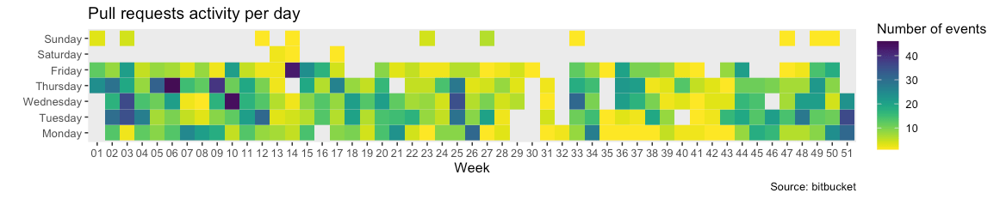

I've been discovering R and Rstudio recently, and I was looking for a dataset to play with.

Let's build a github-like activity mozaic from pull-requests activity on a bitbucket repo.  
It looks like this :



I'm a beginner with R, so please bear with me if some of the code below isn't idiomatic or clever. I'm just having fun. If you have suggestions, please email or tweet.

First, you will need [authentication](https://developer.atlassian.com/bitbucket/api/2/reference/meta/authentication) to access the API. 
Basic auth with an [app password](https://support.atlassian.com/bitbucket-cloud/docs/app-passwords/) was good enough for me.

## Pulling the data

Code contributions aren't the only things I want to consider in my chart. I will take comments and approvals into account as well.

```r{numberLines: true}
library("httr")
library("jsonlite")
library("tidyverse")
library("ggplot2")
library("viridis")
library("dplyr")

username <- 'camille'
endpoint <- "https://api.bitbucket.org/"
pass <- "myAppPassword"
repoSlug <- 'camille/myRepo'

# pull requests
path <- paste0("2.0/repositories/", repoSlug, "/pullrequests")

response <- GET(
  endpoint,
  path = path,
  query = list(state = "MERGED", state = "OPEN", state = "SUPERSEDED"),
  authenticate(username, pass)
)
jsonPayload = fromJSON(
    content(response, as="text")
)

prs = jsonPayload$values

while(!is.null(jsonPayload$`next`)) {
  nextResponse <- GET(
    jsonPayload$`next`,
    authenticate(username, pass)
  )
  jsonPayload = fromJSON(
        content(response, as="text")
    )
  prs <- bind_rows(prs, jsonPayload$values)
}

# Activity
path <- paste0("2.0/repositories/", repoSlug, "/pullrequests/activity")

response <- GET(
  endpoint,
  path = path,
  query = list(state = "MERGED"),
  authenticate(username, pass)
)
jsonPayload = fromJSON(
    content(response, as="text")
)

PRactivity = jsonPayload$values

while(!is.null(jsonPayload$`next`)) {
  nextResponse <- GET(
    jsonPayload$`next`,
    authenticate(username, pass)
  )
  jsonPayload = fromJSON(
      content(nextResponse, as="text")
  )
  PRactivity <- bind_rows(PRactivity, jsonPayload$values)
}
```

## Enhancing the data

I want to sort PRs chronologically and format the dates. Also, I'm only interested in data from 2020.

```r{numberLines: true}
prs <- rev(prs)
prs$created_on <- as.Date(prs$created_on)
prs$updated_on <- as.Date(prs$updated_on)
prs$week <- format(prs$created_on, "%V")
prs$weekOfYear <- format(prs$created_on, "%Y-%V")
prs$year <- format(prs$created_on, "%Y")
prs2020 <- prs %>% filter(year == "2020")


PRactivity <- rev(PRactivity)
approvals <- PRactivity %>% filter(!is.na(approval))
comments <- PRactivity %>% filter(!is.na(comment))
approvals$created_on <- as.Date(approvals$approval$date)
comments$created_on <- as.Date(comments$comment$created_on)
approvals$year <- format(approvals$created_on, "%Y")
approvals2020 <- approvals %>% filter(year == "2020")
comments$year <- format(comments$created_on, "%Y")
comments2020 <- comments %>% filter(year == "2020")
```

## Preparing data for the chart

The only property of interest in any event I want to consider for this chart is its date.  

```r{numberLines: true}
datesApprovals <- approvals2020$created_on
datesComments <- comments2020$created_on
datesPRs <- c(prs2020$created_on, prs2020$updated_on)
allDates <- c(datesPRs, datesComments, datesApprovals)

events = data.frame(
  date = allDates
)
```

I count how many events occurred each day of each week.

```r{numberLines: true}
events$dayOfWeek = format(events$date, "%A")
events$week = format(events$date, "%V")
eventsPerDayOfWeek <- events %>% group_by(week, dayOfWeek) %>% tally()
```

Finally, I want the days of the week to be displayed in an expected order on the chart.

```r{numberLines: true}
eventsPerDayOfWeek <- eventsPerDayOfWeek %>% mutate(
  dayOfWeek = factor(
    dayOfWeek,
    levels=c(
      "Monday", "Tuesday", "Wednesday", "Thursday", "Friday", "Saturday", "Sunday"
    )
  )
)
```

## Drawing the chart


```r{numberLines: true}
ggplot(
        eventsPerDayOfWeek,
        aes(x=week, y=dayOfWeek, fill= n)
    ) +
    geom_tile() +
    labs(
        title = "Pull requests activity per day",
        caption = "Source: bitbucket",
        x = "Week",
        y = "",
        fill= "Number of events"
    ) +
    scale_fill_viridis(discrete=FALSE, direction=-1) +
    theme(
        panel.grid.major = element_blank(),
        panel.grid.minor = element_blank()
    )
```
