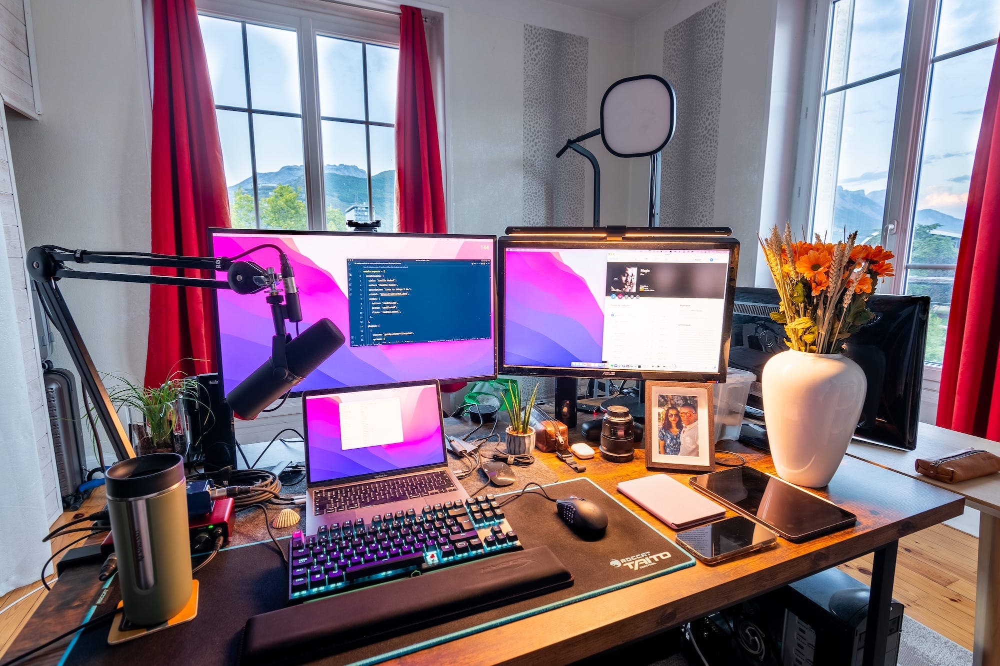

## Productivity
* Alfred -- <small>better Spotlight</small>
* Fantastical -- <small>calendar</small>
* Hey -- <small>email client</small>
* Clockify -- <small>time tracking</small>
* Gmail -- <small>work email client</small>
* Bitwarden -- <small>password management</small>
* Basecamp -- <small>task management for my side projects</small>
* Airtable -- <small>project management for work</small>
* Drafts -- <small>short term notes</small>
* Obsidian -- <small>long term notes</small>
* Safari
* PDF Expert
* Adobe Fill & Sign
* iCloud Drive
* Reminders
* iTerm2
* fish -- <small>shell -- [settings](https://github.com/camille-hdl/configFiles/blob/master/config.fish)</small>
* ChatGPT

## Research / thinking about things
* Kindle -- <small>to ctrl-f in books</small>
* Noteshelf -- <small>searchable handwritten notes</small>
* Rstudio -- <small>computational notebook</small>
* Dictionary -- <small>to find names for things</small>

## Software development
* VScode -- <small>code editor -- [settings](https://github.com/camille-hdl/configFiles/blob/master/vscode-settings.json)</small>
* Querious -- <small>mysql client</small>
* Pages -- <small>to write design docs</small>
* Bitbucket -- <small>git repository & continuous integration</small>
* Github -- <small>git repository & continuous integration</small>
* Confluence -- <small>documentation</small>
* Google Chrome -- <small>devtools</small>
* Cyberduck -- <small>sftp client</small>
* homebrew -- <small>package installer -- [presets](https://github.com/camille-hdl/configFiles/blob/master/brew.sh)</small>
* mailhog -- <small>local email server</small>
* Paw -- <small>API client</small>
* pre-commit
* Podman -- <small>containers that support systemd</small>
* Monodraw -- <small>Make ASCII diagrams in your code comments</small>
* Fathom -- <small>analytics [affiliate link](https://usefathom.com/ref/HV9NG1)</small>

## System administration
* lnav -- <small>log exploration</small>
* Debian -- <small>base OS</small>
* Ansible -- <small>deployment</small>
* monit -- <small>service monitoring and auto-restart, alerts</small>

### Notable VScode extensions
* Night Owl
* GitLens
* Github Copilot

## Media
* imgOptim -- <small>better image compression</small>
* CleanShot X -- <small>Screen recording and screenshots</small>
* FloatingHead -- <small>webcam on screen</small>
* OBS -- <small>when CleanShot X isn't enough</small>
* Spotify -- <small>music</small>
* Overcast -- <small>podcasts</small>
* Audible -- <small>audiobooks</small>
* HandBrake -- <small>video encoding</small>
* DaVinci Resolve -- <small>video editing</small>
* Gifski -- <small>convert videos to gifs for easy embedding in PR descriptions</small>
* Photoshop CC
* Lightroom CC
* AudioHijack, Loopback -- <small>virtual devices, mic noise filter and overall audio management</small>
* Adapter -- <small>bulk format conversion</small>

## Communication
* Messages
* Signal
* Zoom
* Discord
* Teams -- <small>when I have no other choice</small>

## Other
* Rectangle Pro -- <small>window management</small>
* Amphetamine -- <small>mac doesn't go to sleep</small>
* Deliveries -- <small>track amazon packages</small>
* Rocket 🚀 -- <small>emoji</small>
* Authy -- <small>2FA</small>
* GrandPerspective -- <small>disk usage analysis</small>
* Karabiner -- <small>keyboard remapping</small>
* Backblaze -- <small>backup</small>
* PurePaste -- <small>clear formatting from clipboard</small>

## Fonts
* Merriweather -- <small>for writing</small>
* Open Sans -- <small>for titles</small>
* Fira Code -- <small>for code</small>
* EB Garamond -- <small>for fantasy</small>

## Hardware
* 2023 14' Macbook Pro M3 -- <small>[.macos](https://github.com/camille-hdl/configFiles/blob/master/.macos)</small>
* Magic mouse
* Razer Naga X
* Roccat Taito xl mouse pad
* Asus ROG PG279Q -- <small>external display</small>
* SATECHI USB-C adapters
* 10' iPad pro + pencil
* Kindle paperwhite
* [Cooler Master MK730](/cooler-master-mk730-keyboard-on-macos) -- <small>cherry red switches</small>
* HyperX wrist rest
* Nikon D7500 + elgato cam link -- <small>overkill webcam</small>
* NiSi polarising filter -- <small>helps with glare on my glasses</small>
* Sennheiser HD650 -- <small>headphones</small>
* Shure SM7B -- <small>microphone</small>
* Focusrite Scarlett 2i2 3rd gen -- <small>audio Interface</small>
* Cloud Microphones Cloudlifter CL-1 -- <small>pre-amp</small>
* RØDE PSA1 -- <small>studio boom arm</small>
* Amazonbasics monitor arm - <small>B00MIBN16O</small>
* Quntis monitor light
* Kensington SoleMate foot rest
* Incase INMB100335 flight nylon laptop sleeve
* Eaton Ellipse ECO 500 FR Off-Line UPS -- <small>Offline UPS</small>
* APC Power-Saving Back-UPS PRO BR900G-FR 900VA -- <small>Line-interactive UPS</small>
* WD_BLACK P40 -- <small>NVMe external drive</small>
* UGREEN Nexode 140W 25000mAh -- <small>Power Bank</small>

See other `/uses` pages here : https://uses.tech
